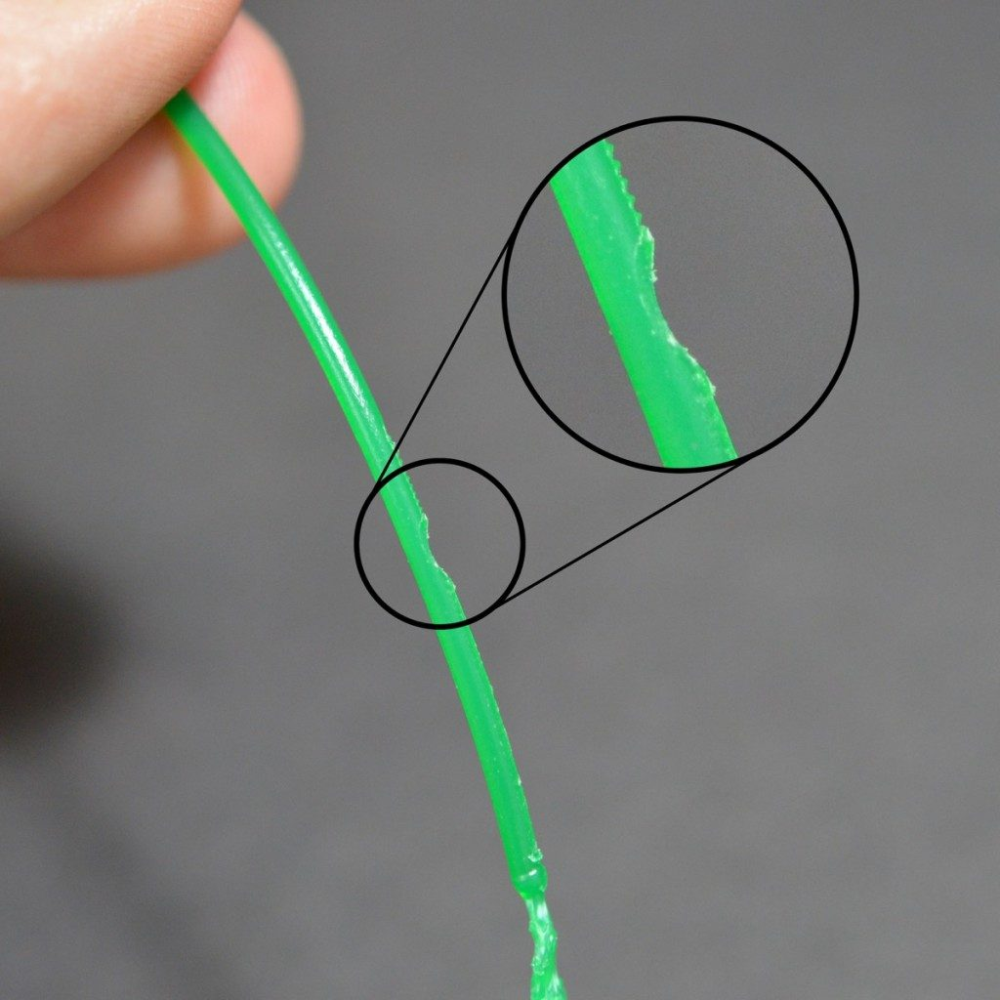
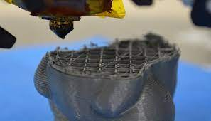
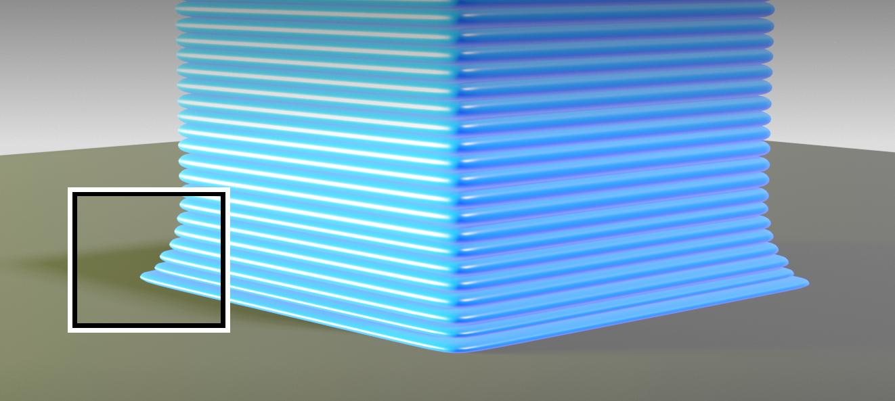
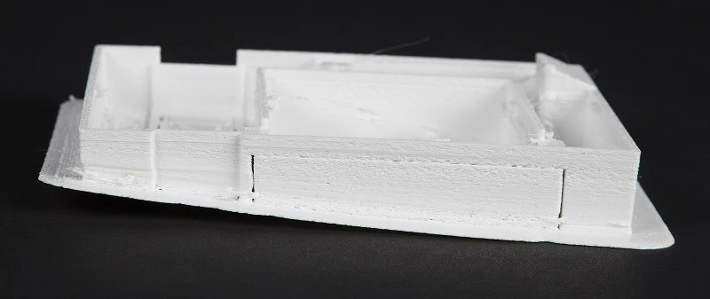

Merhaba!
=====================
katman switchlerinden alın 

.. toctree::
   :glob:
   :maxdepth: 4

Filament Bitti
====================
.. image:: images/filamentbitti.jpg
   :alt: Katman

🤨 Sorun nedir?
----------------- 
 Dilimleme yazılımında model belirlenmesine ve doğru şekilde yapılandırılmasına rağmen hiçbir şey basılmıyor. Ne kadar baskı dosyasını yazıcıya defalarca göndermeyi deniyor olsan da baskı ucundan garip bir parça çıkması dışında hiçbir şey gerçekleşmiyor ya da diğer türlü, baskının yarısı tamamlandıktan sonra filament ekstrüzyonu duruyor ama basım ucu modelin içine hava üflemeye devam ediyor.

🧐 Bu sorun neden kaynaklanır?
-------------------------------
 PRUSA i3 gibi birçok yazıcıda filament makarası tamamen göründüğünden kaçırılması olanaksız bir sorundur ama XYZ DaVinci, Cel Robox ve Ultimaker serilerinde bu  her zaman görünür değildir. Bunlar ve birçok diğer yazıcı, filamenti yazıcı gövdesinin içinde tümden kapalı bulunduruyor ya da arkada tutuyor. Bazı yazıcılar elbette akıllı makaralara sahiptir ve bunlar, yazılıma geri dönüt sağlayarak makaradaki materyalin bitmek üzere olduğunu ya da tükendiğini gösterebiliyor.

 Neyse ki hepimiz bir şeyleri kurcalamayı, üzerinde oynanmış veyahut üçüncü kaynaktan gelen yazılımlar kullanmayı seviyoruz. Her durumda, özellikle Bowden tipi ekstrüzyon sistemlerinde, kalmış bir miktar materyali çıkarıp ardından taze filamenti yerleştirmeniz gerekir.

✅ Çözüm önerisi
--------------
 •Filament makarasını kontrol edin

Nozul tablaya çok yakın
========================
.. image:: images/nozulyakin.jpg
   :alt: Katman

   
🤨 Sorun nedir?
----------------- 
 Açıklanmaz bir şekilde, filamenti doldurmuş olmaya ve basım başının sıkıntısız hareket etmesine rağmen basım yatağında hiç filament birikmiyor.

🧐 Bu sorun neden kaynaklanır?
-------------------------------
 Sorun, gayet basit bir şekilde oluşabilir: basım ucunuz basım yatağına çok yakındır. Eğer olur da basım yatağınızı uçtan sadece birkaç mikron yukarı yerleştirdiyseniz erimiş filamentin dışarı çıkması olanaksız hâle gelir. Bunun sonucunda olacak en iyi şey, baskınızın ilk katlarının hiç basılmaması ve daha sonraki katların yapışmama olasılığının artmasıdır. En kötüsü ise erimiş filamentin basım ucunuzda birikmesi, dolayısıyla ucun tamamen tıkanması olabilir.

✅ Çözüm önerisi
--------------
 •Z eksenini kaydırın;
   Basım ucunun yüksekliğini biraz arttırmak bile genellikle işe yarar. Çoğu 3D yazıcı, sistem ayarlarında Z ekseninin değiştirilmesine izin vermektedir. Basım ucunu basım yatağından uzaklaştırmak adına kaydırmayı pozitif bir değere çekmelisiniz. Bunun aksine, basım ucu yataktan çok uzaktaysa negatif değer vermek baskının yatağa yapışmaması sorununu ortadan kaldırır. Yine de dikkatli olun zira pozitif değeri çok yüksek verirseniz baskınız bu defa basım yatağına yapışmamaya başlar.
 •Basım yatağını alçaltın;
  Bunun yanı sıra yazıcınız müsaade ediyorsa aynı etkiyi basım yatağını alçaltarak da elde edebilirsiniz ancak bu çözüm daha karmaşıktır çünkü basım yatağını alçalttıktan sonra yazıcıyı yeniden kalibre etmeniz ve seviyelemeniz gerekir.

Nozul Tıkandı
==============
.. image:: images/nozzletikandi.jpg
   :alt: Katman
🤨 Sorun nedir?
----------------- 
 Bir baskı işi başlatıyorsunuz ama ne denerseniz deneyin baskı ucundan bir şey çıkmamaktadır. Filamenti çıkarıp yeniden takmak da işe yaramıyor.

🧐 Bu sorun neden kaynaklanır?
-------------------------------
 Baskı ucunun arkasında kalmış küçük bir parça filament, çoğunlukla makaraları değiştirirken  filamentin kırılması sonucu içeride kalmış olabilir. Yeni filament takıldığında ise baskı ucunun içinde kalan eski bir parça filament yeni takılı filamentin uçtan çıkmasına izin vermemektedir.

 Yapılacak küçük bir yazıcı onarımı, ekstrüzyonu etkileyen tıkanma sorunlarını engelleme konusunda epey faydalı olur. Hatta siz çoğunlukla tıkanma ortaya çıkmadan önce baskı ucunun içinde kalan eski, kömürleşmiş filamentin bulunduğunu fark edeceksiniz. O parça orada haftalarca hatta aylarca kalabilir ve siz bunu fark etmeyebilirsiniz ama baskılarınızın kalitesinde fazla olmasa da azalma fark edebileceksiniz.

 İçeri kaçmış eski filamentin oluşturduğu etkiler çoğunlukla gözden kaçırılmaktadır. Bunlardan bazıları; baskının dış duvarlarında oluşan küçük çizikler, koyu filamentin oluşturduğu küçük noktasal şekiller ve modeller arasında az görünen kalite farkıdır.“Atomic Pull” ya da “Cold Pull” olarak bilinen ve daha sonra bahsedeceğimiz yöntemler eski filamenti temizleyebilirsiniz.

 Örneğin, oluşan bu durumu PLA’dan ABS’ye geçerken sıklıkla fark edeceksiniz. Az miktarda PLA uçta kalmıştır ve normal erime noktasından daha yüksek sıcaklıklara ısıtılmıştır. Bu da kalan bir filament parçasının kömürleşip yanabileceğini gösterir.

 Aynı şekilde, ABS’den Nylon’a geçtiğinizde buna benzer bir şeye tanıklık edersiniz. Yeni filament içeri alındığında az miktarda dumanın çıkmasını seyretmek olağanüstü değildir.

✅ Çözüm önerisi
--------------
 •Tıkanıklığı İğneyle Giderin;

  Şansınız varsa tıkanıklık giderme kolay ve hızlı bir işlem olabilir. Filamenti dışarı çıkarmayla başlayın. Bundan sonraysa 3D yazıcınızın kontrol panelini kullanın (eğer varsa) ve “baskı ucunu ısıt” (heat up nozzle) seçeneğini işaretleyin. Sıcaklığı sıkışan filamentin erime sıcaklığı olarak belirleyin. Alternatif olarak, yazıcınızı bilgisayar uyumlu bir kontrol yazılımıyla (örneğin Lulzbot’u ve onun yan programı olan Cura’yı) kullanın ve baskı ucunu o şekilde ısıtın. PLA için sıcaklığı 220℃ olarak belirleyin. Baskı ucu doğru sıcaklığa ulaştığında deliği temizlemek için küçük bir iğne kullanın. Parmaklarınızı yakmamaya özen gösterin. Baskı ucunuz 0.4 mm açıklığında ve daha darsa hava fırçası temizleme kitleri mükemmel bir şekilde işinize yarayacaktır.

 •Eski Filamenti İtin;

  Eğer püskürtme ucunun hâlen tıkanık olduğuna şahitlik ediyorsanız sıkışmış filament parçasını başka bir filament kullanarak dışarı çıkarmayı deneyebilirsiniz. Daha önce yaptığınız gibi filamenti çıkarmayı deneyin ve ardından besleme tüpünü basım başından ayırın. Baskı ucunu PLA için 220℃ sıcaklığa çıkarın ve diğer bir filament parçasını kullanarak yukarıdan aşağıya doğru eski filamenti zorlayın. Yeni filament, eskisini çıkarmayı başaramadıysa yalnızca elinizle yapabileceğiniz ek basınç yararlı olabilir. Yine de yazıcıyı çok zorlamamaya özen gösterin çünkü yatay yazıcı çubuklarını bükebilirsiniz.

  Baskı ucu temizlendiğinde iğneyi, filamentten kalan parçaları temizlemek için tekrar uca yerleştirin ve birkaç defa sokup çıkarın.

 •Sıcak Ucu Parçalayın ve Tekrar Toplayın;

  Ucun hâlen tıkalı kaldığı fevkalade durumlarda küçük bir ameliyat gerçekleştirmeniz ve sıcak ucu parçalamanız gerekecek. Bunu daha önce yapmadıysanız notlar almak ve ucun fotoğraflarını çeşitli açılardan çekmek, ucu yeniden toplayacağınız zaman her şeyi doğru yaptığınızdan emin olmanıza yardımcı olacaktır. Öncelikle filamenti çıkarmakla başlayın, daha sonra yazıcınızın kullanım kılavuzundan sıcak ucu parçalara nasıl ayırabileceğinizi inceleyin.

 •Atomic Pull Yöntemi;

 | **Materyal seçin**:Bunun için ABS ya da Nylon kullanabilirsiniz ama en iyi sonuçların yüksek erime noktası dolayısıyla Nylon’la alındığını gördük. Nylon filament, fiziksel yapısını çok daha iyi korumaktadır. Ama ABS daha yaygın olduğundan açıklamamızda ondan bahsedeceğiz. Ayrıca temizleme filamenti de kullanabilirsiniz.
 | **Filamenti Kaldırın**:Zaten basım başında olan filament parçasını normal bir şekilde kaldırmakla başlayın. Bundan sonraysa Bowden borusunu çıkarın ya da direct drive kullanıyorsanız çarkı serbest bırakın ki zamanı geldiğinde filamenti elinizle itebilesiniz.
 | **Püskürtme Ucu Sıcaklığını Arttırın**:Baskı ucu (nozzle) sıcaklığını 240℃’a çıkarın. Biz ABS kullanıyoruz ancak Nylon kullanmayı tercih ettiyseniz filamentinizin kutusunun üzerinde tavsiye edilen sıcaklık değerini kullanın. Yazıcıyı, filamenti itmeye kalkışmadan bu sıcaklıkta 5 dakikalığına bırakın.
 | **Filamenti İtin**:Filament püskürtme ucundan dışarı çıkana kadar yavaşça baskı uygulayın. Sonrasında filamenti püskürtme ucundan düzgün bir akış elde edene  kadar yavaşça geriye çekip ileriye itmekle işleme devam edin.
 | **Püskürtme Ucunun Sıcaklığını Düşürün**:Baskı ucu sıcaklığını ABS için 180℃ değerine, Nylon içinse 140℃’a düşürün. (Filamentiniz için bir miktar deneme yapmanız gerekecek.) Yazıcıyı bu sıcaklıkta aynı şekilde, tekrar 5 dakikalığına bırakın.
 | **Filamenti Çıkarın**:Filamenti basım başından çıkarın. Ucun içine baktığınızda siyah, kömürleşmiş materyali görmeniz gerekiyor. İşleme temizlik sağlanana kadar devam edin. Filament baskı ucundan çıkmazsa ucun sıcaklığını biraz daha yükseltin.

Filament ezilmesi
==================

🤨 Sorun nedir?
----------------- 
 Filamentin ezilmesi yahut yalama yapması, baskı işleminin herhangi bir anında ve her filamentle gerçekleşebilir. Bunun sonucunda filament sıcak uçtan hiç püskürtülmez ve baskınız aniden sonlanır.

🧐 Bu sorun neden kaynaklanır?
-------------------------------
 Tıkanma, gergi grubunun(idler tensioner) gevşek olması, hatalı sıcak uç sıcaklığı; bütün bunlar yaygın sebeplerden sadece birkaçıdır ancak bunların düzeltilmesi çoğunlukla kolaydır. Sorunun sonucunda ekstruderdaki dişli çark, filamenti yazıcının içinden çekemez ya da itemez hâle gelir. Motor döndükçe çarkın üzerindeki küçük dişlerin normalde filamenti yakalaması ve sisteme beslemesi gerekirken bunlar aşınır ve hiç tutunma olmaz, bundan dolayı hem filament hem de çarklar tutanamaz ve birbirlerinin üstünden kayarlar.

✅ Çözüm önerisi
--------------
 •Sistemin Beslenmesine Yardım Edin;

  Filament eğer yeni kaymaya başladıysa bunu filamentin üzerindeki küçük talaşlardan ve açığa çıkan sesten anlayabilirsiniz. Filamentin sisteme beslenmesine yardım etmek için hafifçe baskı uygulayın. Bu yöntem çoğu durumda makinenin tekrar düzgün bir şekilde çalışmasını sağlar.
 •Gergi Grubu (Idler tensioner) Gerilmesini Ayarlayın;

  Gergi grubunu gevşetmekle başlayın, filamenti sisteme yükleyin ve filament yerleştikten sonra gergi grubunu filament sabitleninceye kadar gerin. Filamentlerin çapı farklıdır, gergi grubu bir miktar farklılığa dayanıklı olsa da bazı filamentlerin ince ayara ihtiyacı olacaktır.
 •Filamenti Kaldırın;

  Çoğu vakada filamenti kaldırmanız ve değiştirmeniz, ardından sisteme tekrar beslemeniz gerekecektir. Filamenti kaldırdığınızda kayma belirtisi gösteren yerin altından kesin. Filamentin kırılmış olması, artık onun kullanılamaz olduğuna işaret ediyor olabilir. Bunu tekrar deneyin ve eğer durum tekrar ediyorsa filamentin zamanı dolmuştur, onu atabilirsiniz.
 •Sıcak Uç Sıcaklığını Kontrol Edin;

 Sorun başladığında siz yeni bir filament yerleştirdiyseniz sıcak ucun sıcaklık değerinin doğru olup olmadığını çifte kontrol edin.

Baskı sırasında filament gelmiyor
==================

🤨 Sorun nedir?
----------------- 
 Bazen, çok sayıda sebepten kaynaklanabilmekle birlikte, sıcak uç filamenti püskürtmeyi bırakır.

🧐 Bu sorun neden kaynaklanır?
-------------------------------
 Tipik olarak bu 3D sorunu, baskı işleminin iki kısmına dayandırılabilir: ya filament ikmaliyle alakalı bir sorun vardır ya sıcak uç / baskı ucunda bir sıkıntı vardır. Sorunun sebebi, filament bitmesi kadar basit bir olay olabilir. Bazı yazıcılar makarayı gizler, filamentin bittiğini nereden bilesiniz?

 Veyahut gergi grubu, ekstruder için çok sıkı olabilir; bu da filamentin ezilmesine, dolayısıyla filamentin sıcak uca ilerlememesine yol açabilir. Buna alternatif olarak  sıcak ucunuzda bir tıkanıklık olması mümkündür, bu da filamentin püskürtülmesini engeller.

✅ Çözüm önerisi
--------------
 •Filamentin Yeterli Olduğundan Emin Olun;

 Biraz bariz bir durum ama hepimizin odaklanmasında ani düşüşler yaşanabilir. Günümüzde çoğu dilimleme (slicing) yazılımı, baskılar için kullanılacak tahmini materyali hesaplar; dolayısıyla yazılımınızın verdiği bu tahmin ve makaranın geriye kalan ağırlığıyla yapacağınız ufak bir karşılaştırma, materyalin yetip yetmeyeceğine dair ipucu verecektir.•Gergi Grubu (Idler tensioner) Gerilmesini Ayarlayın;
 •Baskı Ucu Tıkalı Mı Bakın;

  Eski, yanık filamentle dolmuş  bir baskı ucu çok da farklı sonuçlara yol açmayacaktır. Bunlardan bir tanesi ekstrüzyonun durmuş olmasıdır. Tıkalı baskı uçlarının halledilmesi için özel olarak hazırladığımız çözüm önerimizi incelemenizde fayda var.
 •Sıcak Uç Sıcaklığını Kontrol Edin;

 Sorun başladığında siz yeni bir filament yerleştirdiyseniz sıcak ucun sıcaklık değerinin doğru olup olmadığını çifte kontrol edin.
 •Filamentin Kırılıp Kırılmadığına Bakın;

 Bowden tipi ekstrudera sahip çoğu yazıcının boğuştuğu sorun olan kırılan filament, ekstruder ile sıcak uç arasında bir temassızlığa sebep olabilir. Şükürler olsun ki bunun tespiti ve düzeltilmesi kolaydır; yine de böyle bir durumun meydana gelmiş olması, filamentin son kullanma tarihini geçtiğine işaret eder. Kırılan filament sorununun halledilmesi için özel olarak hazırladığımız çözüm önerimizi incelemenizde fayda var.

Baskı tablaya yapışmıyor
==========================
.. image:: images/tablayayapismiyor.jpg
   :alt: Katman

🤨 Sorun nedir?
----------------- 

 Baskının, basım yatağına yapışamaması sebebiyle kaybedilmesi yaygın bir sorundur ve çözülmesi nispeten kolaydır. Ne yazık ki 3D baskı herhangi bir anda serbest kalabilir. Bu durum daha ilk katmanda ya da aksine en son katmanda gerçekleşebilir, en sonda gerçekleşmesiyse özellikle sinir bozucudur.

 Bu her zaman yazıcının suçu değildir ve eğer siz, basım yatağıyla temas yüzeyi düşük bir modeli basmayı denediyseniz sorun yüksek ihtimalle bu yüzdendir. Şöyle düşünün: Bir uçağın 3D baskısını yapmayı çalıştınız ancak basım yatağıyla tek temas yüzeyi iniş takımlarıdır. Bundan dolayı baskınızın bir raft veya kenarlık (brim) olmadan düzgün basılma ihtimali pek düşük olacaktır, burada desteklerden (support) bahsetmiyoruz bile. Şansımıza bu durum çok yaygın olduğundan onu kolayca düzeltme yolları da fazladır.

🧐 Bu sorun neden kaynaklanır?
-------------------------------
 Bu sorunun en yaygın sebebi, baskının yüzeye ya da basım platformuna tutunamamasıdır. Filamentin tutunması için pürüzlü bir tabana oturması gereklidir, bu sebeple daha iyi bir yapışma yüzeyi yaratmanıza ihtiyaç olacaktır.

 Düz olmayan bir basım platformu, diğer bir önemli sorun olabilir. Platform, baskının herhangi bir bölümünde düzgün olmamışsa baskı ucu, düzgün ekstrüzyon ve yapışma sağlayamayacak kadar platforma uzak kalabilir.

 Kalibrasyon da önemli sorunlardan biri olabilir, zamanla platform ve baskı ucu arasındaki mesafe gitgide artabilir ve en sonunda baş katman platformun içine itilmek yerine rastgele sürüklenmeye başlar.

 Her durumda; yarısı bitmiş modelinizin üstünde bir filament spagettisi, tüm modelinizin bir spagetti hâline geldiğini ya da modelinizin her bir parçasının platformun üstünde rastgele basılmış olduğunu görmeniz olasıdır.

✅ Çözüm önerisi
--------------
 •Pürüzleri Arttırın;

 Filamentinizin platforma tutunma şansını arttırmanız adına platformun üzerine pürüzlü bir materyal koymanız gerekir. Kullanılan en yaygın çözüm, platformun üstüne, sıcak suyla kolaylıkla yıkanabilen bir yapıştırıcı katmanı eklemektir. PLA için başka bir alternatif, boya maske bandı kullanmaktır. 40°C sıcaklığın üstünde erime noktasına sahip filamentler için şimdilerde, sıcağa biraz daha dayanıklı özel bantlar bulunur.
 •Basım Yatağını Seviyelendirin;

 Her yazıcının basım platfromu farklı işlemlerle seviyelendirilir: Örneğin en son çıkan Lulzbot’larda son derece güvenilir bir otomatik seviye sistemi vardır; Ultimaker’larda ise kolay uygulanabilen, el ile ayarlanan bir sistem vardır. Basım yatağı seviyelendirilrmesi için yazıcınızın kullanım kılavuzuna bakın.
 •Baskı Ucunu Ayarlayın;

 Baskı ucu eğer çok yukarıdaysa filament platforma yapışmaz, çok aşağıdaysa baskı ucu, yapışan filamenti resmen kazımaya başlar. Yazıcınızın ayarlar bölümünde “Z ekseninde kaydırma (offset)” seçeneğini bulmayı ve küçük ayarlamalar yapmayı deneyin – baskı ucunu yükseltmek için pozitif değerler ekleyin ya da alçaltmak için negatif değerler verin.
 •Basım Platformunu Temizleyin;

 Cam ve benzeri bir malzemenin üzerinde baskı yapıyorsanız ve özellikle yapıştırıcıyı sıkça kullanıyorsanız bunu ara sıra iyice temizlemek iyi bir fikirdir. Parmaklarınızın bıraktığı kir kalıntıları ve yapıştıcının yüzeyde aşırı birikmesi, basım platformunun yapışkanlığını kaybetmesine neden olabilmektedir.
 •Baskı Platformu Adezyonu Uygulayın;

 Çoğu model, kenarlık (brim) olmadan iyi basılır ama daha küçük nesneler ve platformla temas yüzeyi çok küçük olan modellerin bir miktar baskı plakası adezyonuna (Build Plate Adhesion) ihtiyacı olacaktır. Bunlar, dilimleme yazılımınızda “Brim” (T. kenarlık) ve “Raft” (T. taban döşek) olarak bulunabilir.

 Kenarlık seçeneği, basım yatağıyla temasın başladığı yüzeyden dışarı çıkarak belirli miktarda tek kat çevresel çizgi oluşturur. Bu seçenek, ikisinden daha az israfa sebep olmaktadır ve bizim deneyimimizle en iyisi de budur,  kenarlığı sıyırmak için bir maket bıçağı kullanmak sizin için sorun oluşturmazsa tabiî.

 Raft seçeneği basmak istediğiniz şeklin, kendisinden biraz daha geniş ve kalın, daha iyi yapışan bir gölgesini oluşturur. Baskınız bundan sonra normal bir şekilde oluşturulur. Raft, ana baskıyla oluşturdukları temas yüzeyinde pürüzlü, hoş olmayan bir yüzey açığa çıkarırlar ve bir kenarlıktan daha fazla malzeme harcarlar. Raftın avantajı ise hiç uğraşmaya gerek kalmadan, kırarak sökülebilme özelliğindedir.
 •Destekler (Support) Ekleyin;

 Baskı platformu adezyonunu sağlamakla birlikte şayet modelinizin karmaşık çıkıntıları ya da sarkan yüzeyleri bulunuyorsa baskının tamamını bir arada tutabilmek amacıyla destekler eklediğinizden emin olun.

Baskı tabanı genişliyor
=========================

🤨 Sorun nedir?
----------------- 
 Model tabanında dışarı doğru şişkinlik varsa burada “elephant foot” olarak da adlandırılan bir etki vardır.

🧐 Bu sorun neden kaynaklanır?
-------------------------------
 Bu sorun ilk katmanlar tamamen soğutulup katı hale geçmeden önce modelin ağırlığının aşağı doğru baskı yapmasıyla oluşur. Genellikle yazıcınızın ısıtmalı tablası varsa görülür.
✅ Çözüm önerisi
--------------
 •XY kompanzasyon ayarını açın;

 Bazı dilimleyicilerde bu ayar bulunmaktadır.
 •Tabla Sıcaklığını ve Soğutmayı Ayarlayın;

 3D Baskılarınızda elephant foot görülmesini engellemek için ilk katmanların iyi bir şekilde soğutulması gerekmektedir. Böylece üzerindeki kısımları iyi bir şekilde destekler.
 
 Çok fazla soğutmanın uygulanmasında ise ilk katmanlarda bükülme görülebilir. Dengeyi doğru şekilde sağlamak zor olabilir, bu yüzden baskı platformunun sıcaklığını beşer derece düşürerek başlayın. (Maksimum +/- 20 derece)
 •Baskı Platformunu Kalibre Edin;

 Baskı hatalarının büyük bir bölümünün sebebi baskı platformunun kalibrasyonundan kaynaklanır. Her yazıcının farklı şekilde kalibrasyon sistemi vardır. Üreticinin tavsiye ettiği kalibrasyon işlemiyle yazıcınızı kalibre edin.

 Bir kalibrasyon küpü basmayı deneyin. Küpün basılışından baskı platformunun kalibre edilip edilmediğini kolayca görebilirsiniz.

Baskı köşeleri kalkıyor
========================

🤨 Sorun nedir?
----------------- 
 Modelinizin ilk katmanlarında baskı yukarı doğru bükülebilir. Ayrıca bu üst tarafta yatay çatlaklara ve baskınızın yataktan kopmasına sebep olabilir.

🧐 Bu sorun neden kaynaklanır?
-------------------------------
 Bükülme sorunu genel bir sorundur çünkü bu sorun plastiğin materyal özelliklerinden dolayı olur. ABS veya PLA filamenti soğumaya başladığında biraz küçülürler. Fakat bükülme sorunu plastiğin çok hızlı soğumasından dolayı gerçekleşir.

✅ Çözüm önerisi
--------------
 •Isıtılmış Bir Baskı Yüzeyi Kullanın;

  En kolay çözüm ısıtılmış bir baskı yüzeyi kullanmak ve sıcaklığını iyi şekilde ayarlamaktır. Eğer bunu yaparsanız ilk katman baskı platformuna yapışacaktır. Baskı platformunun sıcaklığı genellikle dilimleme yazılımı ile ayarlanır. Filamentiniz için tavsiye sıcaklığı ruloda veya paketin üstünde bulabilirsiniz.
 •Baskı Tablasına Yapıştırıcı Sürün;

    Eğer hala baskınızın köşeleri kalkıyorsa küçük bir miktarda yapıştırıcı sürmeniz baskının daha iyi şekilde yapışmasını sağlayacaktır.
 •Başka Bir Baskı Platform Türü Kullanın;

    Baskı tablanızı daha iyi adezyon sağlayan bir tabla ile değiştirin. Prusa Research gibi üreticiler yapıştırıcı kullanmadan mükemmel adezyon sağlayan PEI(Polieterimid) baskı yüzeyi kullanıyorlar. Zortrax ve Anycubic 3D yazıcıları ise delikli bir baskı yüzeyine sahip. Böylece modeller çok iyi bir şekilde yüzeye yapışıyor.
 •Baskı Platformunu Kalibre edin;

    Baskı kalibrasyon işlemini yapın. Baskı platformu seviyesinin ve nozzle yüksekliğinin doğru olduğundan emin olun.
 •Yüzey Alanını Arttırın;
    Model ile platform arasındaki yüzey alanını arttırmak kolay bir çözümdür. Birçok dilimleme yazılımı raft veya brim ekleme seçeneğine sahiptir.
 •Gelişmiş Ayarlar;
    Eğer tüm bunlar işe yaramazsa yazılımınızdaki ve yazıcıdaki gelişmiş sıcaklık ayarlarına bir göz gezdirmelisiniz. Baskı tablasının sıcaklığını beşer derece arttırın.

    Dilimleme yazılımındaki soğutma ayarlarına bir bakın. Genellikle 0.5 mm’den sonra soğutma fanı maksimum güçte çalışacak şekilde ayarlanmıştır. Bunu 0.75 veya 1 mm’ye çekerek başlangıç katmanlarının soğuması için biraz daha zaman olacaktır.

İç dolgu ile duvarlar arasında boşluklar
========================================
🤨 Sorun nedir?
----------------- 

🧐 Bu sorun neden kaynaklanır?
-------------------------------

✅ Çözüm önerisi
--------------
 •
 •

Katmanlar kayıyor
===================
🤨 Sorun nedir?
----------------- 

🧐 Bu sorun neden kaynaklanır?
-------------------------------

✅ Çözüm önerisi
--------------
 •
 •