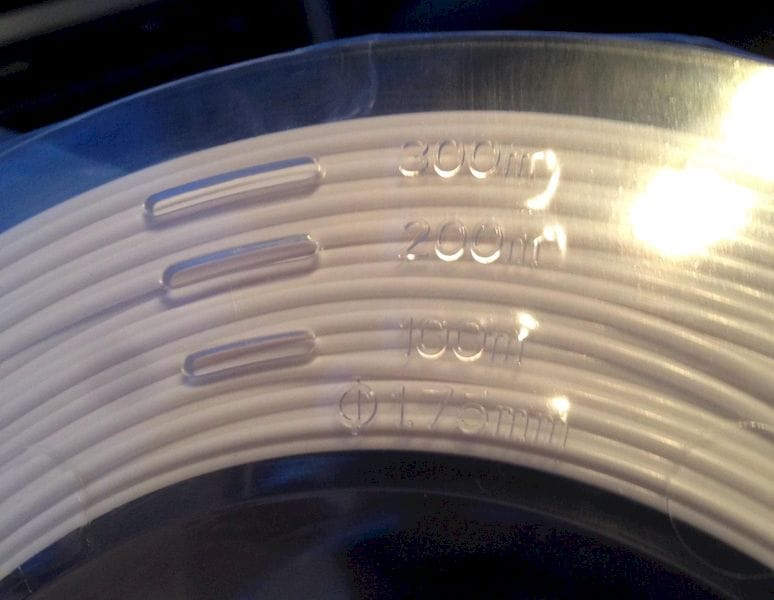
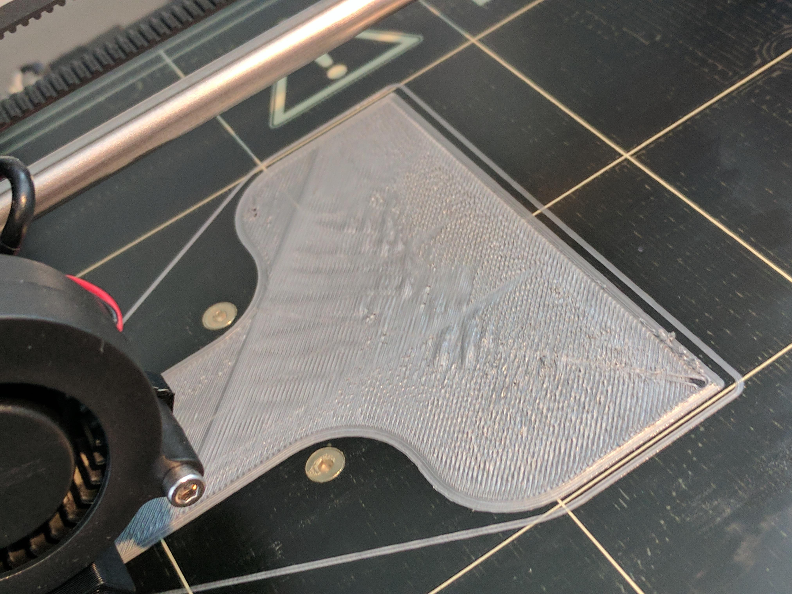
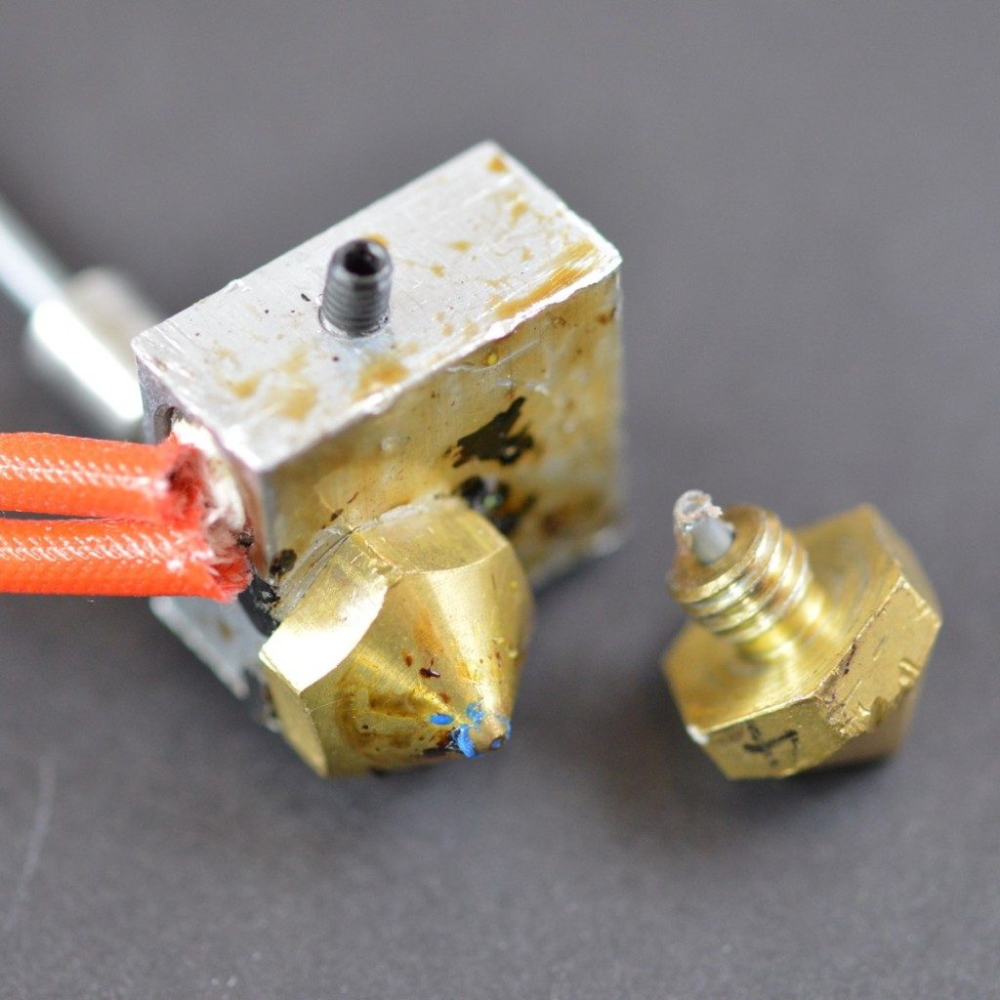

Merhaba!
=====================
katman switchlerinden alın 

.. toctree::
   :glob:
   :maxdepth: 4

Filament Bitti
====================

🤨 Sorun nedir?
----------------- 
Dilimleme yazılımında model belirlenmesine ve doğru şekilde yapılandırılmasına rağmen hiçbir şey basılmıyor. Ne kadar baskı dosyasını yazıcıya defalarca göndermeyi deniyor olsan da baskı ucundan garip bir parça çıkması dışında hiçbir şey gerçekleşmiyor ya da diğer türlü, baskının yarısı tamamlandıktan sonra filament ekstrüzyonu duruyor ama basım ucu modelin içine hava üflemeye devam ediyor.

🧐 Bu sorun neden kaynaklanır?
-------------------------------
PRUSA i3 gibi birçok yazıcıda filament makarası tamamen göründüğünden kaçırılması olanaksız bir sorundur ama XYZ DaVinci, Cel Robox ve Ultimaker serilerinde bu  her zaman görünür değildir. Bunlar ve birçok diğer yazıcı, filamenti yazıcı gövdesinin içinde tümden kapalı bulunduruyor ya da arkada tutuyor. Bazı yazıcılar elbette akıllı makaralara sahiptir ve bunlar, yazılıma geri dönüt sağlayarak makaradaki materyalin bitmek üzere olduğunu ya da tükendiğini gösterebiliyor.

Neyse ki hepimiz bir şeyleri kurcalamayı, üzerinde oynanmış veyahut üçüncü kaynaktan gelen yazılımlar kullanmayı seviyoruz. Her durumda, özellikle Bowden tipi ekstrüzyon sistemlerinde, kalmış bir miktar materyali çıkarıp ardından taze filamenti yerleştirmeniz gerekir.

✅ Çözüm önerisi
--------------
•Filament makarasını kontrol edin

Nozul tablaya çok yakın
========================

   
🤨 Sorun nedir?
----------------- 
Açıklanmaz bir şekilde, filamenti doldurmuş olmaya ve basım başının sıkıntısız hareket etmesine rağmen basım yatağında hiç filament birikmiyor.

🧐 Bu sorun neden kaynaklanır?
-------------------------------
Sorun, gayet basit bir şekilde oluşabilir: basım ucunuz basım yatağına çok yakındır. Eğer olur da basım yatağınızı uçtan sadece birkaç mikron yukarı yerleştirdiyseniz erimiş filamentin dışarı çıkması olanaksız hâle gelir. Bunun sonucunda olacak en iyi şey, baskınızın ilk katlarının hiç basılmaması ve daha sonraki katların yapışmama olasılığının artmasıdır. En kötüsü ise erimiş filamentin basım ucunuzda birikmesi, dolayısıyla ucun tamamen tıkanması olabilir.

✅ Çözüm önerisi
--------------
 •Z eksenini kaydırın;
Basım ucunun yüksekliğini biraz arttırmak bile genellikle işe yarar. Çoğu 3D yazıcı, sistem ayarlarında Z ekseninin değiştirilmesine izin vermektedir. Basım ucunu basım yatağından uzaklaştırmak adına kaydırmayı pozitif bir değere çekmelisiniz. Bunun aksine, basım ucu yataktan çok uzaktaysa negatif değer vermek baskının yatağa yapışmaması sorununu ortadan kaldırır. Yine de dikkatli olun zira pozitif değeri çok yüksek verirseniz baskınız bu defa basım yatağına yapışmamaya başlar.

 •Basım yatağını alçaltın;
Bunun yanı sıra yazıcınız müsaade ediyorsa aynı etkiyi basım yatağını alçaltarak da elde edebilirsiniz ancak bu çözüm daha karmaşıktır çünkü basım yatağını alçalttıktan sonra yazıcıyı yeniden kalibre etmeniz ve seviyelemeniz gerekir.

Nozul Tıkandı
==============

🤨 Sorun nedir?
----------------- 
Bir baskı işi başlatıyorsunuz ama ne denerseniz deneyin baskı ucundan bir şey çıkmamaktadır. Filamenti çıkarıp yeniden takmak da işe yaramıyor.

🧐 Bu sorun neden kaynaklanır?
-------------------------------
Baskı ucunun arkasında kalmış küçük bir parça filament, çoğunlukla makaraları değiştirirken  filamentin kırılması sonucu içeride kalmış olabilir. Yeni filament takıldığında ise baskı ucunun içinde kalan eski bir parça filament yeni takılı filamentin uçtan çıkmasına izin vermemektedir.

Yapılacak küçük bir yazıcı onarımı, ekstrüzyonu etkileyen tıkanma sorunlarını engelleme konusunda epey faydalı olur. Hatta siz çoğunlukla tıkanma ortaya çıkmadan önce baskı ucunun içinde kalan eski, kömürleşmiş filamentin bulunduğunu fark edeceksiniz. O parça orada haftalarca hatta aylarca kalabilir ve siz bunu fark etmeyebilirsiniz ama baskılarınızın kalitesinde fazla olmasa da azalma fark edebileceksiniz.

İçeri kaçmış eski filamentin oluşturduğu etkiler çoğunlukla gözden kaçırılmaktadır. Bunlardan bazıları; baskının dış duvarlarında oluşan küçük çizikler, koyu filamentin oluşturduğu küçük noktasal şekiller ve modeller arasında az görünen kalite farkıdır.“Atomic Pull” ya da “Cold Pull” olarak bilinen ve daha sonra bahsedeceğimiz yöntemler eski filamenti temizleyebilirsiniz.

Örneğin, oluşan bu durumu PLA’dan ABS’ye geçerken sıklıkla fark edeceksiniz. Az miktarda PLA uçta kalmıştır ve normal erime noktasından daha yüksek sıcaklıklara ısıtılmıştır. Bu da kalan bir filament parçasının kömürleşip yanabileceğini gösterir.

Aynı şekilde, ABS’den Nylon’a geçtiğinizde buna benzer bir şeye tanıklık edersiniz. Yeni filament içeri alındığında az miktarda dumanın çıkmasını seyretmek olağanüstü değildir.

✅ Çözüm önerisi
--------------
 •Tıkanıklığı İğneyle Giderin;

Şansınız varsa tıkanıklık giderme kolay ve hızlı bir işlem olabilir. Filamenti dışarı çıkarmayla başlayın. Bundan sonraysa 3D yazıcınızın kontrol panelini kullanın (eğer varsa) ve “baskı ucunu ısıt” (heat up nozzle) seçeneğini işaretleyin. Sıcaklığı sıkışan filamentin erime sıcaklığı olarak belirleyin. Alternatif olarak, yazıcınızı bilgisayar uyumlu bir kontrol yazılımıyla (örneğin Lulzbot’u ve onun yan programı olan Cura’yı) kullanın ve baskı ucunu o şekilde ısıtın. PLA için sıcaklığı 220℃ olarak belirleyin. Baskı ucu doğru sıcaklığa ulaştığında deliği temizlemek için küçük bir iğne kullanın. Parmaklarınızı yakmamaya özen gösterin. Baskı ucunuz 0.4 mm açıklığında ve daha darsa hava fırçası temizleme kitleri mükemmel bir şekilde işinize yarayacaktır.
 •Eski Filamenti İtin;

Eğer püskürtme ucunun hâlen tıkanık olduğuna şahitlik ediyorsanız sıkışmış filament parçasını başka bir filament kullanarak dışarı çıkarmayı deneyebilirsiniz. Daha önce yaptığınız gibi filamenti çıkarmayı deneyin ve ardından besleme tüpünü basım başından ayırın. Baskı ucunu PLA için 220℃ sıcaklığa çıkarın ve diğer bir filament parçasını kullanarak yukarıdan aşağıya doğru eski filamenti zorlayın. Yeni filament, eskisini çıkarmayı başaramadıysa yalnızca elinizle yapabileceğiniz ek basınç yararlı olabilir. Yine de yazıcıyı çok zorlamamaya özen gösterin çünkü yatay yazıcı çubuklarını bükebilirsiniz.

Baskı ucu temizlendiğinde iğneyi, filamentten kalan parçaları temizlemek için tekrar uca yerleştirin ve birkaç defa sokup çıkarın.
 •Sıcak Ucu Parçalayın ve Tekrar Toplayın;

Ucun hâlen tıkalı kaldığı fevkalade durumlarda küçük bir ameliyat gerçekleştirmeniz ve sıcak ucu parçalamanız gerekecek. Bunu daha önce yapmadıysanız notlar almak ve ucun fotoğraflarını çeşitli açılardan çekmek, ucu yeniden toplayacağınız zaman her şeyi doğru yaptığınızdan emin olmanıza yardımcı olacaktır. Öncelikle filamenti çıkarmakla başlayın, daha sonra yazıcınızın kullanım kılavuzundan sıcak ucu parçalara nasıl ayırabileceğinizi inceleyin.
 •Atomic Pull Yöntemi;

| **Materyal seçin**:
Bunun için ABS ya da Nylon kullanabilirsiniz ama en iyi sonuçların yüksek erime noktası dolayısıyla Nylon’la alındığını gördük. Nylon filament, fiziksel yapısını çok daha iyi korumaktadır. Ama ABS daha yaygın olduğundan açıklamamızda ondan bahsedeceğiz. Ayrıca temizleme filamenti de kullanabilirsiniz.
| **Filamenti Kaldırın**:
Zaten basım başında olan filament parçasını normal bir şekilde kaldırmakla başlayın. Bundan sonraysa Bowden borusunu çıkarın ya da direct drive kullanıyorsanız çarkı serbest bırakın ki zamanı geldiğinde filamenti elinizle itebilesiniz.
| **Püskürtme Ucu Sıcaklığını Arttırın**:
Baskı ucu (nozzle) sıcaklığını 240℃’a çıkarın. Biz ABS kullanıyoruz ancak Nylon kullanmayı tercih ettiyseniz filamentinizin kutusunun üzerinde tavsiye edilen sıcaklık değerini kullanın. Yazıcıyı, filamenti itmeye kalkışmadan bu sıcaklıkta 5 dakikalığına bırakın.
| **Filamenti İtin**:
Filament püskürtme ucundan dışarı çıkana kadar yavaşça baskı uygulayın. Sonrasında filamenti püskürtme ucundan düzgün bir akış elde edene  kadar yavaşça geriye çekip ileriye itmekle işleme devam edin.
| **Püskürtme Ucunun Sıcaklığını Düşürün**:
Baskı ucu sıcaklığını ABS için 180℃ değerine, Nylon içinse 140℃’a düşürün. (Filamentiniz için bir miktar deneme yapmanız gerekecek.) Yazıcıyı bu sıcaklıkta aynı şekilde, tekrar 5 dakikalığına bırakın.
| **Filamenti Çıkarın**:
Filamenti basım başından çıkarın. Ucun içine baktığınızda siyah, kömürleşmiş materyali görmeniz gerekiyor. İşleme temizlik sağlanana kadar devam edin. Filament baskı ucundan çıkmazsa ucun sıcaklığını biraz daha yükseltin.

Filament ezilmesi
==================
.. image:: images/nozzletıkandi.jpg
   :alt: Katman
🤨 Sorun nedir?
----------------- 

🧐 Bu sorun neden kaynaklanır?
-------------------------------

✅ Çözüm önerisi
--------------
 •
 •

Baskı sırasında filament gelmiyor
==================================
🤨 Sorun nedir?
----------------- 

🧐 Bu sorun neden kaynaklanır?
-------------------------------

✅ Çözüm önerisi
--------------
 •
 •

Baskı tablaya yapışmıyor
==========================
🤨 Sorun nedir?
----------------- 

🧐 Bu sorun neden kaynaklanır?
-------------------------------

✅ Çözüm önerisi
--------------
 •
 •

Baskı tabanı genişliyor
=========================
🤨 Sorun nedir?
----------------- 

🧐 Bu sorun neden kaynaklanır?
-------------------------------

✅ Çözüm önerisi
--------------
 •
 •

Baskı köşeleri kalkıyor
========================
🤨 Sorun nedir?
----------------- 

🧐 Bu sorun neden kaynaklanır?
-------------------------------

✅ Çözüm önerisi
--------------
 •
 •

İç dolgu ile duvarlar arasında boşluklar
========================================
🤨 Sorun nedir?
----------------- 

🧐 Bu sorun neden kaynaklanır?
-------------------------------

✅ Çözüm önerisi
--------------
 •
 •

Katmanlar kayıyor
===================
🤨 Sorun nedir?
----------------- 

🧐 Bu sorun neden kaynaklanır?
-------------------------------

✅ Çözüm önerisi
--------------
 •
 •